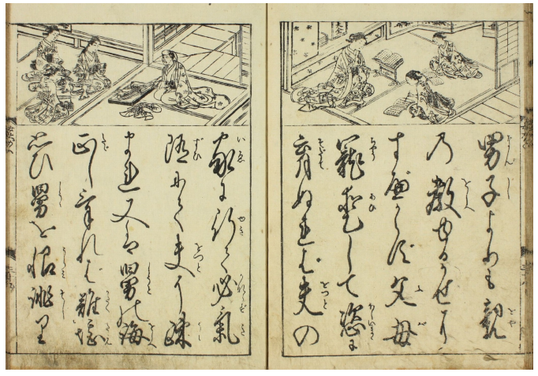
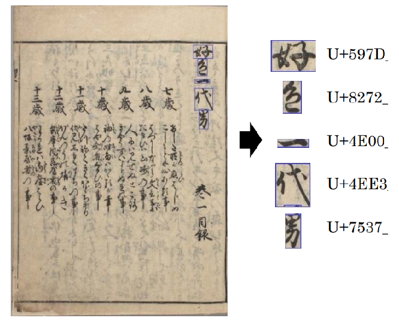
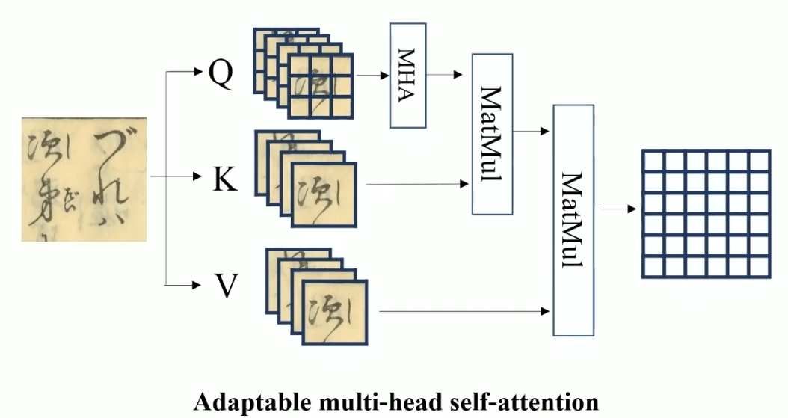
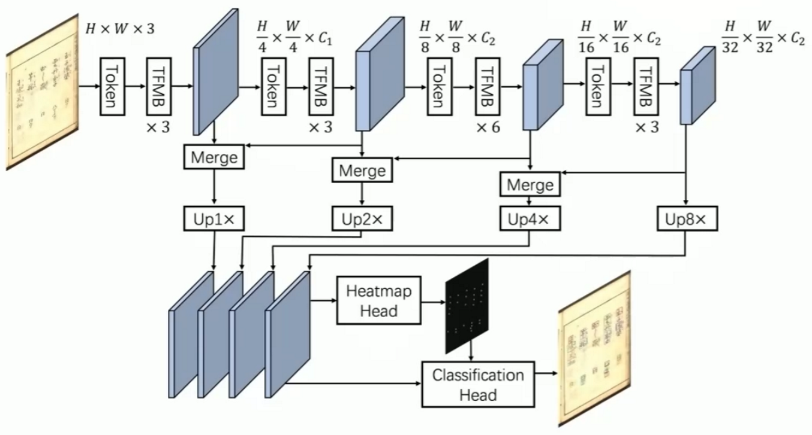

# Kuzushiji-Recognition




This study presents an implementation of a deep learning algorithm for the recognition of Kuzushiji script.

Kuzushiji is a historical cursive script of Japanese that was commonly used prior to the 19th century. 

📚 [Check the paper](https://arxiv.org/abs/1812.01718) to learn more about Kuzushiji.


## Datasets
Kuzushiji Dataset was made by CODH(Center for Open Data in the Humanities). It consists of 1,086,326 characters and 4,328 types. Each kuzushiji has a unique Unicode corresponding to it. 



📚 You can download the dataset from [here](http://codh.rois.ac.jp/char-shape/book/) 

## Requirements
- GPU: NVIDIA GeForce RTX 3090
- cuda: 11.4
- Python 3.8 & Pytorch 1.13.1
- mmdetection

## Overview

I used a combination of some classic models: 
Cascade RCNN + Multi-head self attention network + CenterNet



Use one-stage detection to learn more latent information.

## Run

Install mmdetection

Install requirement.txt

```
$ conda env create -f env.yaml
```

Also try the intro ipynb for visualization of Kuzushiji!


### Preprocessing

- I convert the annotation into COCO format. 
- Delete no annotation images in the dataset.
  
You can follow the notebook for more details.

### Detection

```
$ python train.py [path to dataset]
```

### Evaluation

The result is F1 score.

```
$ python submits\kuzushiji_competition_metric.py --sub_path [submission.csv] --solution_path [groundtruth.csv]
```


## Try other SOTA model
Through mmdetection, we can also compare with other SOTA models, such as DETR, Yolo, etc. The folloing is the result of my own attempt to reproduce: 

|Model                            | F1 score| 
|---------------------------------|-------|
| Faster RCNN | 0.874 | 
| CenterNet | 0.897 | 
|  DETR  | 0.912 |
|  Ours  | 0.950 | 